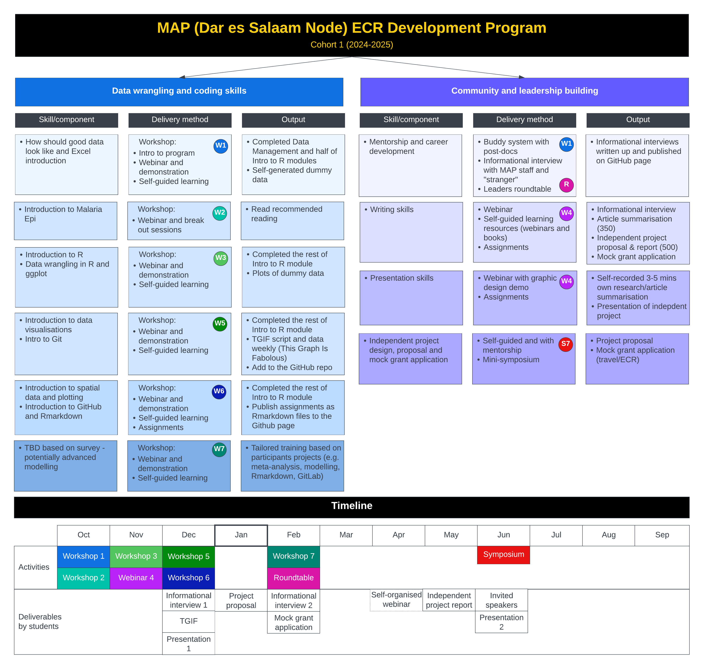

This repo is currently under construction!\
\
Welcome to MAP's Dar es Salaam node's ECR training program for Cohort 1 (2024-2025)! 😊\
\
This program builds on MAP's "[Introduction of Spatial Analysis for Infectious diseases tutorial](https://malaria-atlas-project.gitlab.io/intro-to-spatial-analysis-for-infectious-diseases/index.html)" material.

The course has been re-arranged and updated according to a new delivery method (workshops fortnightly). The training program consists of **"Data and coding"** section and as well as **"Community and leadership building"** component. As part of the program, the participants will be sharing their assignments (e.g. informational interviews, R scripts) on this page via GitHub. 

The aim of the data tutorials is to teach basic concepts, skills and tools for working with data so that you can get more done in less time, and with less pain. The lessons here focus mainly on the use of R and QGIS.\
\

This repo consists of webpage elements in html and also R tutorial material.
